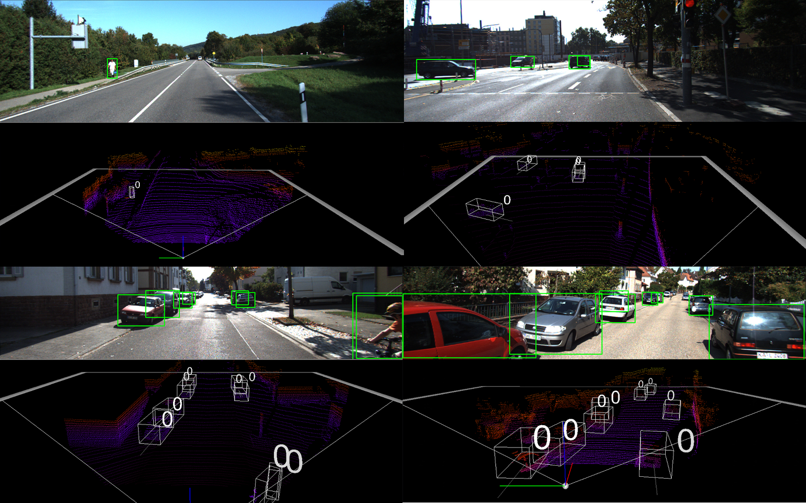

# Frustum-PointCNN

This repository is the implementation of [THIS](http://journal.dcs.or.kr/_common/do.php?a=current&b=11&bidx=2845&aidx=32116)



## Usage

This repository is implemented and tested with Tensorflow 1.6 in python3 scripts. Tensorflow before 1.5 version is not recommended, because of API. It has dependencies on some python packages such as transforms3d, h5py, plyfile, and maybe more if it complains. Install these packages before the use of Frustum-PointCNN.


### Segmentation

We use farthest point sampling (the implementation from PointNet++) in segmentation tasks. Compile FPS before the training/evaluation:
```
cd sampling
bash tf_sampling_compile.sh
```

### Prepare Training Data
In this step we convert original KITTI data to organized formats for training our Frustum PointNets. <b>NEW:</b> You can also directly download the prepared data files <a href="https://shapenet.cs.stanford.edu/media/frustum_data.zip" target="_blank">HERE (960MB)</a> -- to support training and evaluation, just unzip the file and move the `*.pickle` files to the `kitti` folder.

Firstly, you need to download the <a href="http://www.cvlibs.net/datasets/kitti/eval_object.php?obj_benchmark=3d" target="_blank">KITTI 3D object detection dataset</a>, including left color images, Velodyne point clouds, camera calibration matrices, and training labels. Make sure the KITTI data is organized as required in `dataset/README.md`. You can run `python kitti/kitti_object.py` to see whether data is downloaded and stored properly. If everything is fine, you should see image and 3D point cloud visualizations of the data. 

Then to prepare the data, simply run: (warning: this step will generate around 4.7GB data as pickle files)

    sh scripts/command_prep_data.sh

Basically, during this process, we are extracting frustum point clouds along with ground truth labels from the original KITTI data, based on both ground truth 2D bounding boxes and boxes from a 2D object detector. We will do the extraction for the train (`kitti/image_sets/train.txt`) and validation set (`kitti/image_sets/val.txt`) using ground truth 2D boxes, and also extract data from validation set with predicted 2D boxes (`kitti/rgb_detections/rgb_detection_val.txt`).

You can check `kitti/prepare_data.py` for more details, and run `python kitti/prepare_data.py --demo` to visualize the steps in data preparation.

After the command executes, you should see three newly generated data files under the `kitti` folder. You can run `python train/provider.py` to visualize the training data (frustum point clouds and 3D bounding box labels, in rect camera coordinate).

### Training 

To start training (on GPU 0) the model, just run the following script:

    CUDA_VISIBLE_DEVICES=0 sh scripts/command_train_v1.sh


### Evaluation
To evaluate a trained model (assuming you already finished the previous training step) on the validation set, just run:

    CUDA_VISIBLE_DEVICES=0 sh scripts/command_test_v1.sh

